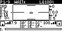
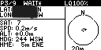
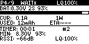
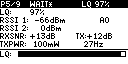
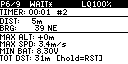
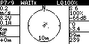
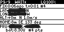

# RMpocketHUD

`RMpocketHUD` is a telemetry HUD Lua script for the `RadioMaster Pocket` 128x64 monochrome display.

Current release: `v0.1.1`

## Features

- Artificial horizon: the drone's actual tilt angle drawn as a moving horizon line
- Battery: voltage, current draw, mAh used, and estimated remaining flight time
- GPS: coordinates, altitude, speed, heading, and direction back to home
- Signal: link quality, RSSI, SNR, and TX power
- Radar map: top-down breadcrumb map of where the quad has been relative to launch
- Flight stats: max altitude, max speed, total distance flown, and lowest battery recorded
- Stick inputs and switches: live control input page

## Target

- Radio: `RadioMaster Pocket`
- Display: `128x64 monochrome`
- Telemetry: `Betaflight + ExpressLRS / CRSF`

## Install

### 1. Copy the file

Plug your radio into your PC via USB, then select `USB Storage` on the radio.

Copy `TELEM.lua` to:

- `SD Card -> SCRIPTS -> TELEMETRY -> TELEM.lua`

If the `TELEMETRY` folder does not exist, create it.

### 2. Assign it to a telemetry screen

On the radio:

- Go to `Model Settings` 
- Scroll down to `Telemetry`
- Scroll down to `Screens`
- Pick any screen slot and change the type to `Script`
- Select `TELEM`

### 3. Open it

On the home screen:

- press `TELE`

It should load the HUD.

### 4. Per-drone setup

Each model needs its own telemetry screen assignment.

If you have multiple drones saved as separate models, repeat step 2 for each one.

The script file itself only needs to be on the SD card once.

### 5. Learn sensors (first time per drone)

If sensors show `---`, go to:

- `Model Settings -> Telemetry -> Discover Sensors`

Do this once per model while the drone is connected and powered.

That sensor list will then be saved for that model.

## Screenshots

Available pages captured from the radio:

- Page 1: Home / HUD  
  
- Page 3: GPS / Nav  
  
- Page 4: Power  
  
- Page 5: Signal  
  
- Page 6: Flight Stats  
  
- Page 7: Radar  
  
- Page 9: Find My Quad  
  

## Notes

- The script auto-saves GPS to `/LOGS/QUAD_POS.txt`
- No extra setup is needed for the GPS save feature
- This script expects CRSF-style telemetry from Betaflight / ExpressLRS

## Release Layout

- [TELEM.lua](TELEM.lua): working source file
- [releases/v0.1.1/SCRIPTS/TELEMETRY/TELEM.lua](releases/v0.1.1/SCRIPTS/TELEMETRY/TELEM.lua): SD-card-ready release file
- [RMpocketHUD-v0.1.1.zip](https://github.com/RLee203/RMpocketHUD/releases/download/v0.1.1/RMpocketHUD-v0.1.1.zip): packaged release zip

## Version

This repo starts at `v0.1.0`.

